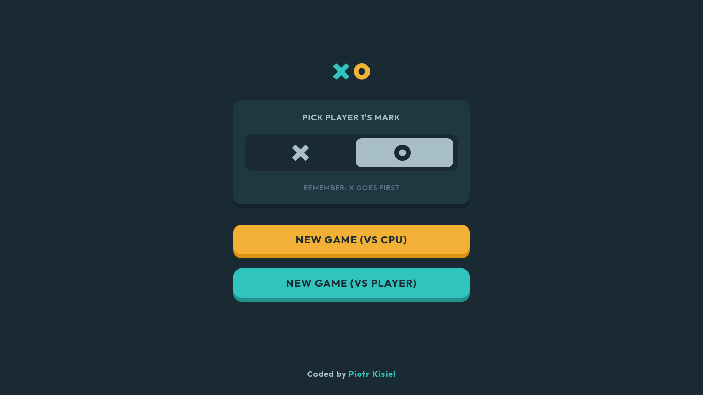
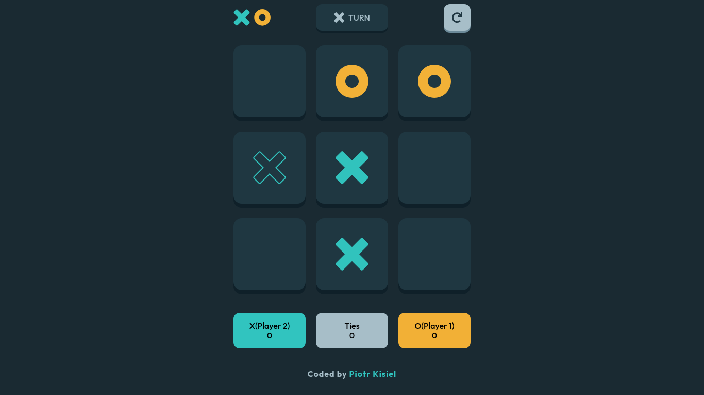
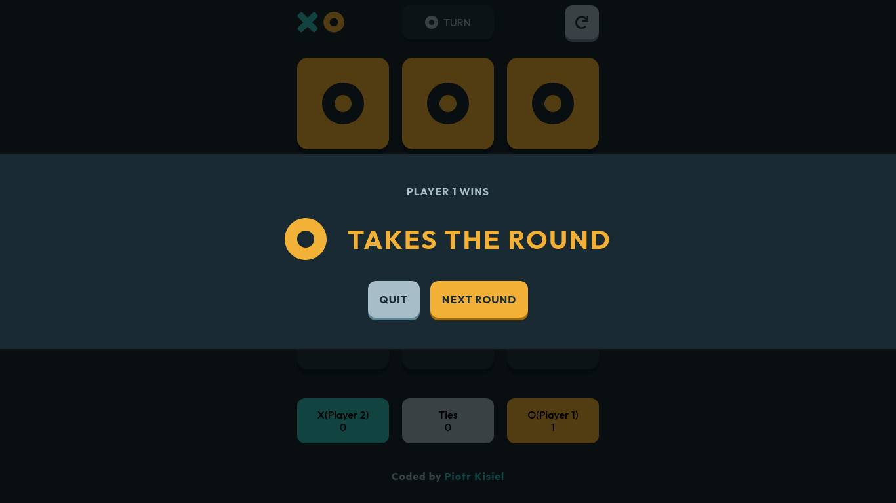

# Tic Tac Toe

This is a solution to the [Tic Tac Toe challenge on Frontend Mentor](https://www.frontendmentor.io/challenges/tic-tac-toe-game-Re7ZF_E2v) and [Project: Tic Tac Toe on The Odin Project](https://www.theodinproject.com/lessons/node-path-javascript-tic-tac-toe).

# [Open live version](https://your-live-site-url.com)

## Table of contents

- [Overview](#overview)
  - [The challenge](#the-challenge)
  - [Screenshots](#screenshot)
  - [Links](#links)
- [My process](#my-process)
  - [Built with](#built-with)
  - [What I learned](#what-i-learned)
  - [Continued development](#continued-development)
- [Author](#author)

## Overview

### The challenge

Users should be able to:

- View the optimal layout for the game depending on their device's screen size
- See hover states for all interactive elements on the page
- Play the game either solo vs the computer or multiplayer against another person

### Screenshots

#### New game

#### Game ongoing

#### Round won

### Links

- Live Site: [GitHub Pages](https://your-live-site-url.com)
- Solution Code: [GitHub](https://github.com/pietyr/tic-tac-toe)

## My process

### Built with

- JavaScript
- Vite
- SASS
- Flexbox
- CSS Grid
- Semantic HTML5 markup
- CSS animations

### What I learned

- Using JavaScript to manipulate DOM
- CSS Grid
- Vite
- Basics of CSS animations

### Continued development

What can be added in the future:

- Save the game state in the browser so that it’s preserved if the player refreshes their browser
- Instead of having the computer randomly make their moves, try making it clever so it’s proactive in blocking your moves and trying to win

What to focus on in future projects:

- Better organization of JavaScript.

## Author

- Github - [pietyr](https://github.com/pietyr)
- Frontend Mentor - [@pietyr](https://www.frontendmentor.io/profile/pietyr)
